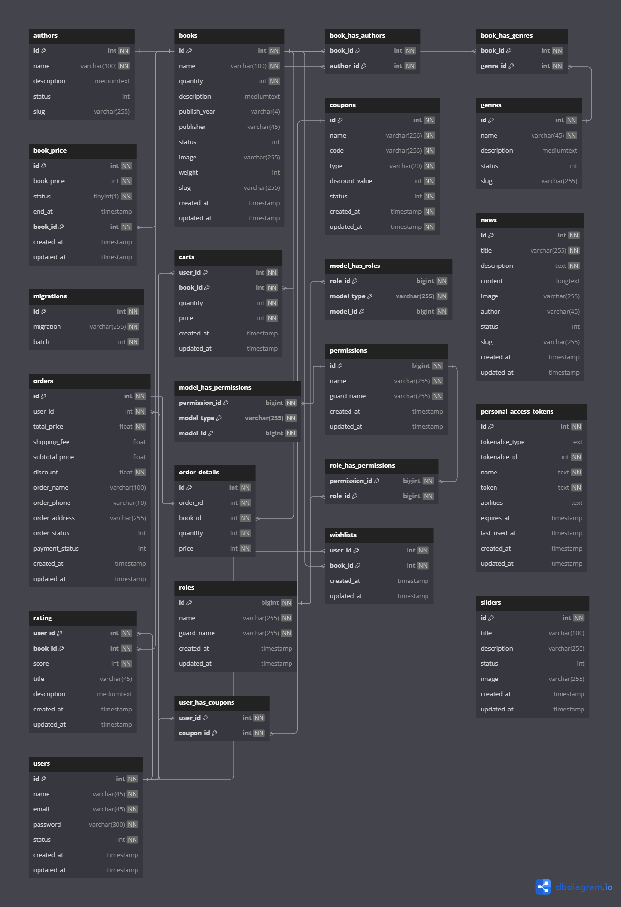

# PHP Laravel E-Bookstore Platform

An e-commerce platform for selling books, built using PHP Laravel, Blade, and Bootstrap. This project offers a complete solution for online book shopping with features like product (book) management, user authentication, shopping cart, and order tracking.

## Features

### **Level 1 - Essential** 
_This requirement is critical to the project's success. The project cannot proceed without this feature._
- **User Authentication**:
  - Supports login and registration.  
  - Role-based access control (Admin, Customer, or Role created).
- **Book Management**:
  - Admin can add, edit, and delete books.
  - Categorization by genres, authors, and tags.
  - Detailed descriptions including price, author bio, and book previews.
- **Shopping Cart**: Add, edit, and remove books from the cart, dynamic cart total calculation.
- **Order Management**:
  - Customers can place orders and provide delivery details.
  - View order history
  - Track order and delivery status with GiaoHangNhanh API.
- **Checkout and Payment**: Integrated with a payment gateway (VNPAY) or COD.
- **Discounts and Coupons**: Apply discounts during checkout.
- **Blog Section**:
  - Publish news and updates related to books and the store.
  - Support for rich text and images.
- **User Interaction**:
  - Book Reviews and Ratings: Customers can leave reviews and rate books.
  - Wishlist: Save books for future purchases.
- **Admin Dashboard**: Sales tracking.
- **Responsive Design**: Optimized for both desktop and mobile devices.

### **Level 2 - Future**
_This requirement is beyond the scope of this project and has been included here for potential future releases._
- **User Authentication**: 
  - Google OAuth2: Login using Google accounts.
- **User Interaction**:
  - Comment, like the post in blog section.

## Technologies Used

- **Backend**:
  - PHP Laravel
  - Eloquent ORM (MySQL database)
- **Frontend**:
  - Blade (Laravel templating engine)
  - Bootstrap (responsive design framework)
- **Other**:
  - Composer (dependency management)
  - NPM (JavaScript package management)
  - Livewire Datatable (admin dashboard)
  - CKEditor5 (Rich text editor)
  - VNPAY Gateway (checkout)

## Project Structure

```
├── app
│   ├── Http
│   │   ├── Controllers    # Application controllers
│   │   ├── Middleware     # Custom middleware
│   ├── Models             # Eloquent models
├── database
│   ├── migrations         # Database migrations
│   ├── seeders            # Database seeders
├── resources
│   ├── views              # Blade templates
│   ├── js                 # JavaScript files
│   ├── css                # CSS files
├── public                 # Static assets (CSS, JS, Images)
├── routes
│   ├── web.php            # Web routes
│   ├── api.php            # API routes
|   ├── auth.php           # Authentication routes
```

## Database


